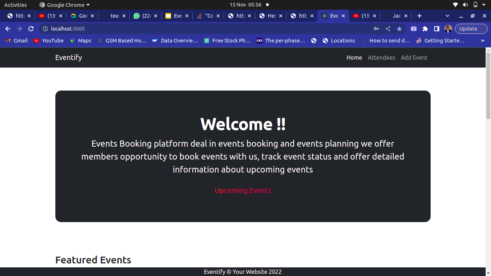

&nbsp;

# Eventify

> It is a website that shows all upcoming events and it enables users to book events

## Built With

---

&nbsp;&nbsp;&nbsp;&nbsp;&nbsp;&nbsp;&nbsp;&nbsp;&nbsp;


[Live Demo Link]()


## Getting Started

To get a local copy up and running follow these simple example steps.

## Getting a local copy

---

```
git clone https://github.com/JackNdigara/event-booking-app
cd event-booking-app
```

## Authors

👤👤 **Kiprotich Kimutai**

- GitHub: [@Kimutai01](https://github.com/Kimutai01)
- Twitter: [@Kimutai_01](https://twitter.com/Kimutai_01?s=09)
- LinkedIn: [@kiprotichkimutai](https://www.linkedin.com/m/in/kimutai-kiprotich-1b5045216)

👤👤 **Felix Ondulah**

- GitHub: [@Kimutai01](https://github.com/Kimutai01)
- Twitter: [@Kimutai_01](https://twitter.com/Kimutai_01?s=09)
- LinkedIn: [@kiprotichkimutai](https://www.linkedin.com/m/in/kimutai-kiprotich-1b5045216)

👤👤 **Jason Kiptoo **

- GitHub: [@Kimutai01](https://github.com/Kimutai01)
- Twitter: [@Kimutai_01](https://twitter.com/Kimutai_01?s=09)
- LinkedIn: [@kiprotichkimutai](https://www.linkedin.com/m/in/kimutai-kiprotich-1b5045216)

👤👤 **Peter Jackson**

- GitHub: [@Kimutai01](https://github.com/Kimutai01)
- Twitter: [@Kimutai_01](https://twitter.com/Kimutai_01?s=09)
- LinkedIn: [@kiprotichkimutai](https://www.linkedin.com/m/in/kimutai-kiprotich-1b5045216)

## 🤝 Contributing

Contributions, issues, and feature requests are welcome!

Feel free to check the [issues page](../../issues/).

## Show your support

Give a ⭐️ if you like this project!

## Acknowledgments

- Hat tip to anyone whose code was used
- Inspiration
- etc

## 📝 License

This project is [MIT](./LICENSE) licensed.

_NOTE: we recommend using the [MIT license](https://choosealicense.com/licenses/mit/) - you can set it up quickly by [using templates available on GitHub](https://docs.github.com/en/communities/setting-up-your-project-for-healthy-contributions/adding-a-license-to-a-repository). You can also use [any other license](https://choosealicense.com/licenses/) if you wish._
